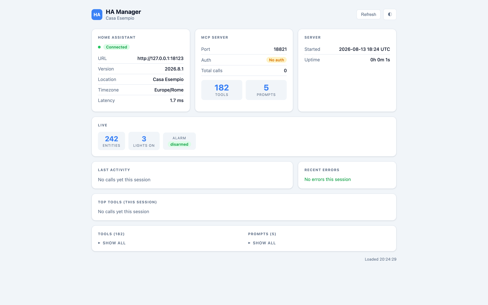

# HA MCP Server

An [MCP](https://modelcontextprotocol.io/) server that exposes Home Assistant's
REST and WebSocket APIs as **189 tools** (185 registered by default — four are
off until explicitly enabled, see [the registration
gate](#the-registration-gate-three-groups-two-defaults) below), so an MCP
client — Claude Code among others — can drive an instance directly.

Lights, climate, covers, media, alarm and cameras; automations, scripts, scenes,
helpers and dashboards; the area, floor, label, device and entity registries;
add-ons, HACS, backups and system health; history, logbook, statistics and
energy.

A status dashboard shows what the server sees and which tools have been called.

> **It can also delete things** — automations, dashboards, helpers, users. Every
> tool was exercised against a live instance before release, but treat it as
> what it is: a broad, powerful interface to your home. `create_user`,
> `update_user` and `delete_user` — the tools that manage Home Assistant login
> accounts, not entities — are **disabled by default**; see [the registration
> gate](#the-registration-gate-three-groups-two-defaults) below to turn them
> on.



> The screenshot is generated by `scripts/screenshots.py` against a mock of the
> Home Assistant API, never against a real instance — the dashboard puts the
> location name in the page title.

## Two ways to run it

### As a Home Assistant app

The easiest route if you already run Home Assistant: the app reaches it through
the Supervisor, so no long-lived token has to be created, and the dashboard is
available in the sidebar through ingress.

[](https://my.home-assistant.io/redirect/supervisor_add_addon_repository/?repository_url=https%3A%2F%2Fgithub.com%2Fdriin0%2Fhome-assistant-apps)

Repository: [driin0/home-assistant-apps](https://github.com/driin0/home-assistant-apps).
That repository holds only the packaging — the code is here, and it ships the
image published from this repository.

### As a container

For a Home Assistant instance you do not control, or to run the server
elsewhere:

```bash
git clone https://github.com/driin0/ha-mcp-server
cd ha-mcp-server
cp .env.sample .env      # fill in HA_URL, HA_TOKEN and MCP_SECRET
docker compose up -d
```

The image (`ghcr.io/driin0/ha-mcp-server`) is published multi-architecture
(amd64, arm64), so nothing is built locally. To work on the code, replace `image:` with `build: .` in
`compose.yaml`.

| Variable | Default | Meaning |
|---|---|---|
| `HA_URL` | — | Home Assistant base URL, e.g. `http://homeassistant.local:8123` |
| `HA_TOKEN` | — | a long-lived access token |
| `MCP_SECRET` | — | bearer token clients must present |
| `MCP_ALLOW_NO_AUTH` | `false` | start without a secret — only on a trusted network |
| `MCP_ALLOWED_HOSTS` | empty | extra hostnames/IPs (comma-separated, no scheme or port) the MCP endpoint may be reached at, beyond `localhost` — see below |
| `UI_SECRET` | — | Basic Auth password for the status dashboard — its own secret, independent of `MCP_SECRET` (see below) |
| `UI_ALLOW_NO_AUTH` | `false` | serve the dashboard without a password — only on a trusted network, and a decision separate from `MCP_ALLOW_NO_AUTH` (see below) |
| `MCP_PORT` / `UI_PORT` | `47821` / `47822` | ports on the host |
| `HA_DEFAULT_LANGUAGE` | empty | language for conversation tools |
| `HA_ALEXA_KEYWORDS` | `echo,alexa` | media players treated as Alexa devices |
| `HA_REMOTE_PREFIXES` | empty | entity prefixes routed as remotes |
| `MCP_ENABLE_USER_MANAGEMENT` | `false` | registers `create_user`/`update_user`/`delete_user` (see below) |
| `MCP_ENABLE_PHYSICAL_SECURITY` | **`true`** | registers `lock_control`/`alarm_control` — set to `false` to remove them (see below) |
| `MCP_ENABLE_ADDON_API` | `false` | registers `call_addon_api` (see below) |
| `HA_INGRESS_MODE` | `false` | skip the dashboard's Basic Auth — only when reached exclusively through HA Supervisor Ingress (see below) |

### UI_SECRET is its own secret, not MCP_SECRET reused

The dashboard sends `UI_SECRET` as HTTP Basic — base64-encoded, not
encrypted, and this project ships no TLS. Earlier releases defaulted
`UI_SECRET` to `MCP_SECRET` when unset, which meant a passive observer on
the same LAN who saw a single dashboard page load recovered a base64 string
that decodes to the full-admin MCP bearer token. `UI_SECRET` is now
independent: generate its own value (`openssl rand -base64 32`, same as
`MCP_SECRET` — just a different one), and set it explicitly. With neither
`UI_SECRET` set nor `HA_INGRESS_MODE=true`, the dashboard refuses to start
unless `UI_ALLOW_NO_AUTH=true` says to serve it without a password anyway
(trusted networks only).

### HA_INGRESS_MODE

Set only by the Home Assistant app's own `run.sh` — not something a
container deployment normally needs. When the dashboard is reached
exclusively through the HA Supervisor's Ingress proxy, HA has already
authenticated the user before the request ever reaches this server, and
Ingress requests carry no `Authorization` header at all (Basic Auth would
401 every one of them). `HA_INGRESS_MODE=true` skips the dashboard's Basic
Auth middleware for exactly that reason — it does not skip `UI_SECRET`
checking as a matter of policy so much as make it moot, since Ingress is
the only path in.

That trust assumption holds specifically because the add-on's
`config.yaml` maps only port `47821` (the MCP endpoint, still bearer-auth
protected) to the host — port `47822` (the dashboard) is reachable only
from the internal `hassio` Docker network, not the LAN. The residual: any
other add-on running on the same Home Assistant instance is also on that
internal network, so a compromised co-resident add-on reads the dashboard
unauthenticated, always, regardless of `MCP_SECRET`/`UI_SECRET`. This is a
narrower exposure than the LAN (an add-on has to already be installed) but
is not nothing — the dashboard shows tool names, call statistics and recent
error text, no secrets or tokens (see `stats.py`'s redaction).

Do **not** set this in a container deployment unless something equivalent
to Supervisor Ingress sits in front of this server and nothing else can
reach port `47822` — otherwise it removes the dashboard's authentication
entirely, on a port most reverse-proxy setups do not otherwise protect.

### Two separate "no auth" decisions

`MCP_ALLOW_NO_AUTH` and `UI_ALLOW_NO_AUTH` control two different things and
must each be opted into on their own:

- `MCP_ALLOW_NO_AUTH` lets the **MCP endpoint** — where tools are called,
  with full control over Home Assistant — start with `MCP_SECRET` empty.
- `UI_ALLOW_NO_AUTH` lets the **status dashboard** — read-only system info
  and call statistics, no tool-calling surface — start with `UI_SECRET`
  empty.

Setting one does **not** set the other. Earlier releases conflated the two:
`MCP_ALLOW_NO_AUTH` alone satisfied both startup checks, so setting it to
get the MCP endpoint running silently left the dashboard unauthenticated as
well, with nothing saying so. `MCP_SECRET` being set, regardless of either
flag, still means the MCP endpoint requires it; `HA_INGRESS_MODE=true`
still means the dashboard needs neither `UI_SECRET` nor `UI_ALLOW_NO_AUTH`,
since Ingress authenticates upstream.

### Origin and Host validation

A browser page on the same network can be made, via DNS rebinding, to reach
this server directly: the page's `Origin`/`Host` still name the attacker's
domain, but the connection lands here after that domain's DNS record is
re-pointed at the local IP. This matters most when `MCP_SECRET` is empty —
the configuration `MCP_ALLOW_NO_AUTH` exists to create — because after the
rebind the attacker's page is same-origin with this server, so no other
check catches it.

The MCP endpoint therefore rejects any request that carries an `Origin`
header not resolving to `localhost` or one of the hostnames/IPs listed in
`MCP_ALLOWED_HOSTS`, and equally rejects one whose `Host` header does not
resolve to one of the same. This runs unconditionally, whether or not
`MCP_SECRET` is set. A request with **no** `Origin` header at all — the
ordinary shape of a non-browser MCP client — is not affected: only a real
browser can send one, and a browser cannot omit it. If your MCP client runs
inside a browser and reaches this server at a LAN IP or a hostname other
than `localhost`, add it to `MCP_ALLOWED_HOSTS` or every request from it
will be rejected with 403 and a line in the server's log explaining why.

### The registration gate: three groups, two defaults

Nothing server-side can make an MCP client ask for confirmation before
calling a tool — the one guardrail this server *can* enforce is not
registering a tool at all, so it never appears in the client's menu. Three
groups of tools go through this gate, each behind its own env var:

| Group | Tools | Env var | Default |
|---|---|---|---|
| `user_management` | `create_user`, `update_user`, `delete_user` | `MCP_ENABLE_USER_MANAGEMENT` | off |
| `physical_security` | `lock_control`, `alarm_control` | `MCP_ENABLE_PHYSICAL_SECURITY` | **on** |
| `addon_api` | `call_addon_api` | `MCP_ENABLE_ADDON_API` | off |

**`user_management`, off by default.** `create_user`, `update_user` and
`delete_user` manage Home Assistant **login accounts**, a different risk
tier from turning off a light or even deleting a scene: a request that
sounds routine ("add a account for the cleaner") is a privileged,
account-creating action, and almost nobody needs a language model to have
that capability.

**`physical_security`, on by default.** Locks and the alarm panel are, unlike
user accounts, a normal and common reason to run this server at all —
disabling them by default would break the ordinary case, and upgrading from
an earlier release must not make capabilities disappear with no error, only
absence. They are still gated, unlike other actuating tools, because they
are the two tools a prompt-injection payload would most want to reach: a
cast speaker's `media_title` or an entity's own `friendly_name` can carry
attacker-controlled text into a model's context before any tool is even
called (see `get_live_context()`'s docstring). Set
`MCP_ENABLE_PHYSICAL_SECURITY=false` to remove them if you would rather a
model never see them at all.

⚠️ **This particular gate is weaker than the other two.** `call_service` can
invoke `lock.unlock` and every `alarm_control_panel.*` service directly, and
is not covered by this or any gate — so disabling `physical_security`
removes the *named, discoverable* tools from an MCP client's `tools/list`,
which is real value against an injection that names a tool by its obvious
name, but it does **not** remove the underlying capability from a caller
willing to use `call_service` instead.

**`addon_api`, off by default.** `call_addon_api` is a generic proxy into
whatever HTTP API an installed add-on exposes — few installations need a
language model to have this, and unlike locks or the alarm panel it is not
why most people run this server. Unlike `physical_security`, this gate *is*
a full capability removal: neither `call_service` nor `fire_event` can reach
the Supervisor's per-add-on API endpoint at all.

Every other tool that existed in earlier releases — every `delete_*`,
`restart_homeassistant`, `apply_update` — stays ungated and registered by
default.

If a tool you expect is missing, call `list_disabled_tools()` — it is always
registered, and reports which groups are gated, whether each is currently on,
and the env var that controls it.

`call_service` and `fire_event` themselves are **not** covered by this or
any gate: they are generic passthroughs (any Home Assistant service, any
event on the bus) that a named-tool gate cannot cover without also
restricting them specifically, and restricting either would remove far more
than the gated tools above — so treat them as carrying the safety weight of
whatever they are pointed at, not the weight of their own name.

## Connecting a client

```json
{
  "mcpServers": {
    "homeassistant": {
      "type": "http",
      "url": "http://<host>:47821/",
      "headers": { "Authorization": "Bearer <MCP_SECRET>" }
    }
  }
}
```

## Development

```bash
pip install -r requirements.txt
HA_URL=… HA_TOKEN=… MCP_ALLOW_NO_AUTH=true python3 server.py
```

The tools live in `tools/`, one module per area, and register themselves through
`tools/_base.py`. `web.py` serves the dashboard; `stats.py` keeps the call
counters behind it.

### Tests

```bash
pip install -r requirements-dev.txt
pytest tests/
```

Runs against an in-process fake Home Assistant, no real instance needed. A
normal run prints a warning stating how much of the tool surface the runtime
conformance check actually covers (it calls every tool that takes no
arguments and confirms it returns the expected shape) — that is a
disclosure, not noise, so don't silence warnings to make it go away.

### Reference validation

A Home Assistant automation cut mains power to a running NAS mid-write and
corrupted 245 GB. The guard was `{{ not is_state("button.nas_shutdown",
"unavailable") }}`, and the entity had been renamed. In Home Assistant the
state of an entity that does not exist is `None`, never the string
`"unavailable"` — so `is_state()` returned `False`, `not False` is `True`,
and the guard silently started passing instead of blocking. A second,
independent fault stacked on top of it: a `wait_for_trigger` with a timeout
and no `continue_on_timeout: false` carried execution past the guard into
`switch.turn_off` against a machine still writing to disk. Neither fault
raised an error, wrote a log line, or tripped a repair issue.

Four tools exist to catch both shapes before they cause damage:

- **`validate_automation`** / **`validate_all_automations`** — check every
  entity/device an automation references against this instance's live
  registries and state machine (`dead_reference`, `restored`, `unavailable`,
  `unknown`), and separately report any `wait_for_trigger` that can
  silently carry a timeout into a destructive action. These are reported as
  two separate lists (`issues` and `fail_open_waits`) because the incident
  needed both faults to cause damage — reading only one undercounts.
  `unknown` is kept separate from `unavailable` and reported at a lower
  severity: on a vanilla instance with nothing wrong, several entity types
  (buttons, event entities, scenes, some helper and voice-pipeline
  entities) sit in `unknown` as their ordinary resting state, while
  `unavailable` never happens as a resting state — see `tools/validation.py`'s
  own docstring for the measurement.
- **`find_entity_usages`** — "if I rename or remove this entity, what
  breaks?", searched across automations and scripts only (not dashboards,
  template entities or helpers).
- **`list_orphan_entities`** — registry entries with no current state,
  exactly what a reconfigured integration leaves behind.

**`scripts/lint_automations.py`** is a CLI over the same validator, for CI or
a schedule:

```bash
HA_URL=https://your-instance:8123 HA_TOKEN=… python3 scripts/lint_automations.py
```

It prints every dead reference, restored reference, unavailable reference,
unknown reference and fail-open wait it finds, and exits:

- `0` — no dead references and no fail-open waits found (there may still be
  `restored`/`unavailable`/`unknown` findings printed above — an integration
  problem, or often nothing at all for `unknown` — not a config defect, so
  none of the three fail the build).
- `1` — at least one dead reference or fail-open wait was found — see the
  printed report for which automation and which one.
- `2` — the sweep could not run at all (missing `HA_URL`/`HA_TOKEN`, or a
  transport/WebSocket failure reading the registry or states).

There is no offline mode: resolving a reference needs the live entity/device
registry, which a YAML file on disk cannot answer about itself.

### A note on the base image

The image is built on `python:3.13-alpine` **on purpose**, and its Alpine and
Python versions must stay aligned with the Home Assistant base image
(`ghcr.io/home-assistant/base-python:3.13-alpineX.Y`). The Home Assistant app
copies the compiled packages from this image rather than reinstalling them, and
native extensions — `pydantic_core`, `cryptography`, `rpds`, `websockets` —
only load if musl and the Python minor version match. The Dockerfile imports
them at build time so a future mismatch fails there, not at first start.

## Licence

Copyright (C) 2026 Riccardo Riina (driin0)

Distributed under the **GNU Affero General Public License v3.0**.
See [LICENSE](LICENSE).

## Trademarks

**Home Assistant** and its logo are trademarks of the
[Open Home Foundation](https://www.openhomefoundation.org/). The **Model Context
Protocol** and its mark belong to [Anthropic](https://www.anthropic.com/). This
project is independent and is not affiliated with, nor endorsed by, either.
